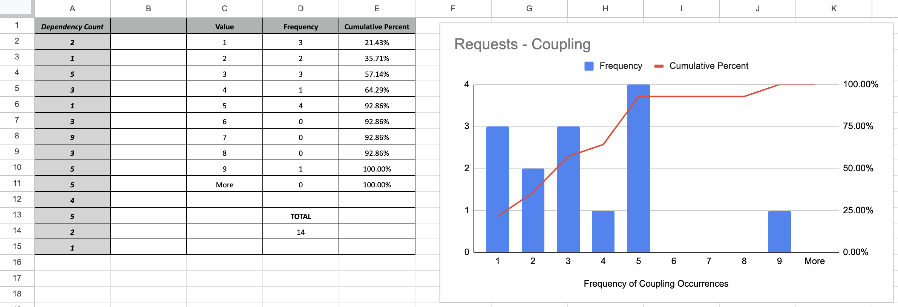
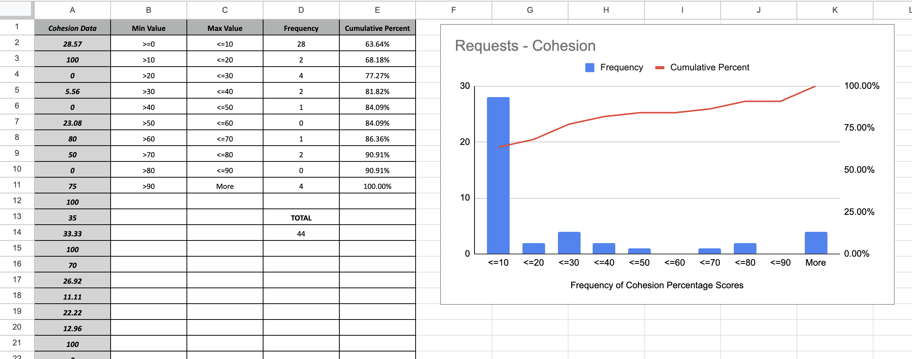
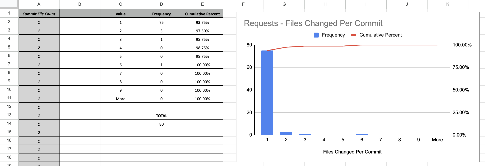

Software Architecture & Design
# Quality Metrics
This exercise will help you gather metrics to analyze several quality metrics in several Python repositories.

1. [Choose Repositories](https://github.com/amajor/software-architecture-quality-attributes/blob/main/README.md#choose-repositories)
2. [Collect Metrics](https://github.com/amajor/software-architecture-quality-attributes/blob/main/README.md#collect-metrics)
   1. [Coupling](https://github.com/amajor/software-architecture-quality-attributes/blob/main/README.md#coupling)
   2. [Cohesion](https://github.com/amajor/software-architecture-quality-attributes/blob/main/README.md#cohesion)
   3. [Commit Size](https://github.com/amajor/software-architecture-quality-attributes/blob/main/README.md#commit-size)
   4. [Maintainability Index](https://github.com/amajor/software-architecture-quality-attributes/blob/main/README.md#maintainability-index)

---

# Choose Repositories

Here are a few public Python repositories that you might analyze:

1. `pallets/flask` - https://github.com/pallets/flask
2. `psf/requests` - https://github.com/psf/requests
3. `sqlmapproject/sqlmap`	- https://github.com/sqlmapproject/sqlmap
4. `fail2ban/fail2ban` - https://github.com/fail2ban/fail2ban
5. `s3tools/s3cmd` - https://github.com/s3tools/s3cmd
6. `bear/python-twitter` - https://github.com/bear/python-twitter

# Collect Metrics

## Coupling

Coupling measures the level of dependency between various packages/modules in a system. We desire LOW coupling (low dependencies).

You will need a tool called `pyreverse`. This tool is now included with installations of `pylint` (https://pylint.readthedocs.io/en/latest/pyreverse.html).

```bash
# Confirm if you already have pyreverse installed (this will show the help docs if it is installed)
pyreverse -h
```

Once you have `pyreverse`, we can use it to generate some `dot` files to analyze.

First, know where the majority of your Python files reside. For example, if we are going to analyze [`psf/requests`](https://github.com/psf/requests), we'll find the Python files reside in the path [`src/requests`](https://github.com/psf/requests/tree/main/src/requests); we can tell by clicking in the file structure in the repository and looking for `.py` files.

Let's generate `dot` files using the path `./src/requests/` and use the file naming prefix `requestsCode` for our example:

```bash
# First, be sure you are inside the repository folder.
# Use `cd` to "change directory" to where you need to be after you've cloned the project.
cd requests

# Now run pyreverse with the following flags and naming
pyreverse -my -s1 -a1 -k -p requestsCode ./src/requests/
```

Here are what the flags mean (use `pyreverse -h` to get these details):
* `-my` = include module name in representation of classes
* `-s1 ` = show one level of associated classes not in the project
* `-a1` = show one generation of ancestor classes not in the project
* `-k` = don't show attributes and methods in the class boxes; this disables -f values
* `-p` = set the project name

Now you have two new files:
* `packages_requestsCode.dot`
* `classes_requestsCode.dot`

We can use our `coupling.py` script to do some quick parsing for us (download [here](https://github.com/amajor/software-architecture-quality-attributes/blob/main/coupling/coupling.py)):

```bash
# Navigate into whatever directory holds this file
python3 coupling.py
```

You will be prompted to input the path to the packages dot file (named something like `package_xxx.dot`).

Then you will get an output something like this:

```
Enter packages_xxx.dot file path: requests/packages_requests2.dot

Packages Dot File: requests/packages_requests2.dot
----------

Module Dependency Output: 
 - module requests is dependent on requests.__version__
 - module requests is dependent on requests.api
 - module requests is dependent on requests.exceptions
...

----------
Module Dependency Frequencies: 

2
1
5
...
```

With the numbers under the output "Module Dependency Frequencies," you can now do some analysis.

1. Copy that list of numbers into a spreadsheet (column 'A').
2. Review the values and type them into a new column, each value with its own cell. I used the values 1 through 9, then made a "More" cell. (column 'C')
3. Let's calculate **frequency**. Frequency is how many times each value occurs. Using the range of cells in column 'A', you can use a formula like `=COUNTIF(A2:A15, C2)` to count the occurrences of each value, replacing `C2` with the appropriate cell. For the "More" value, use a formula like `=COUNTIF(A2:A15, ">=10")`
4. Visuals are helpful when analyzing frequencies. Create a bar graph using your values (x-axis) and their frequencies (y-axis)



Remember that we want LOW coupling for projects. We generally have low coupling if the larger bars in your graph are for lower numbers. If the bars in your graph are bigger for higher numbers, we may have higher coupling.

What does your bar graph tell you about the repository you are analyzing? What should the team working on that repository consider to improve or maintain this particular quality attribute?

## Cohesion

Cohesion measures how a class's healthy methods and member variables belong. As a rule of thumb, a good design should exhibit HIGH cohesion and low coupling.

You will need the tool `cohesion` (pypi.org/project/cohesion) installed. If you already have `pip` installed, you can use the command:

```bash
python3 -m pip install cohesion
```

Find class cohesion for all classes in the project by executing the following command (replacing pythonCodeDirectory with the correct directory):


```bash
cohesion -d pythonCodeDirectory/ | grep Total |sed 's/\s\{1,\}Total: \(.*\)\%$/\1/'
```

This will output a bunch of numbers. Similar to the example in the Coupling explanation, you can make a bar graph that shows the frequency of the values you outputted. Instead of individual values, you may want to calculate based on ranges.

1. Copy that list of numbers into a spreadsheet (column 'A').
2. Review the values and create ranges up to 100%. (column 'C')
3. Let's calculate frequency. Frequency is how many times each value occurs in each range. Using the range of cells in column 'A', you can use a formula like `=COUNTIFS(A2:A45,B2,A2:A45,C2)` to count the occurrences of each value, replacing `C2` with the appropriate cell. For the "More" value, use a formula like `=COUNTIF(A2:A45,B11)` where the value in `B11` is `>90`
4. Visuals are helpful when analyzing frequencies. Create a bar graph using your values (x-axis) and their frequencies (y-axis)



What does your analysis of the cohesion values tell you about the project? 

## Commit Size

Remember that one of the quality metrics that we are interested in is modifiability/changeability (the amount of effort needed to change the system, add more functionality or fix bugs).

As a proxy for measuring modifiability, we will use the number of files that need to be changed in a git commit.

A commit typically represents implementing a new feature, deprecating an old feature, or fixing a bug.

Good architecture should allow new features to be added to the system with the least necessary file changes.

In other words, changes should be local to a handful of files/modules. We should see small numbers of changes per commit.

Find the number of files changed in git commits using the following command. The command needs to be executed from within the git directory of the project. 

```bash
git log --stat | grep '[0-9]\{1,\} file[s]* changed' | sed 's/\([0-9]\{1,\}\) file.*/\1/'
```

This will output a bunch of numbers. Similar to the example in the Coupling explanation, you can make a bar graph that shows the frequency of the values you outputted.



If you have a higher frequency of smaller numbers, that means that most git commits focused on changing few files (which can also indicate that features can be added or updated without touching a lot of files).

What does your analysis tell you about the project? Does the team tend to change a lot of files at once, or can they generally make changes pretty easily, touching few files per commit?

## Maintainability Index
